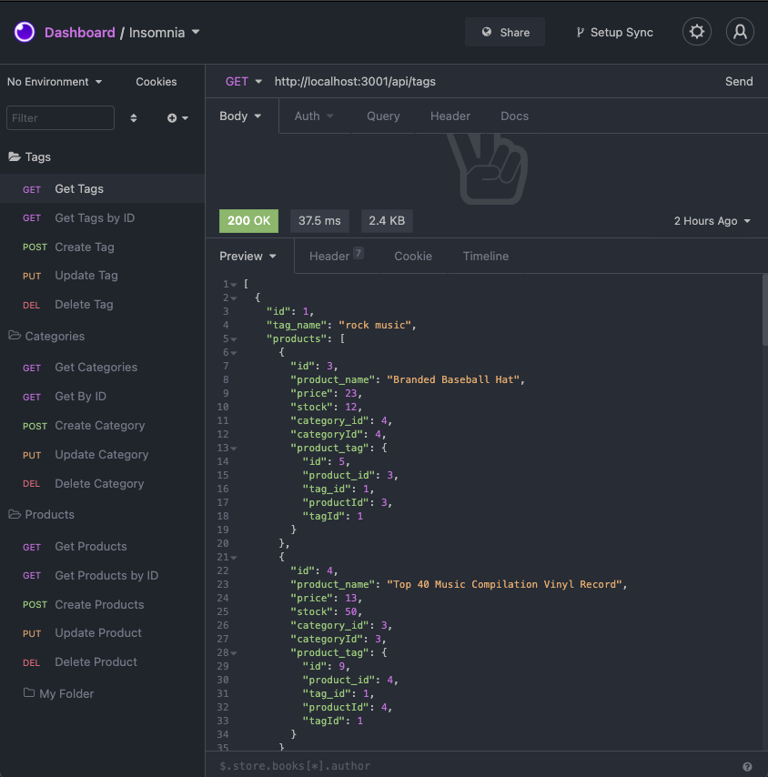

# ORM_E-Commerce

OSU HW wk 13

## Description

A nodeJs app to create an Express.js API. This app uses Sequelize to interact with a MySQL Database to GET, PUT, POST, and DELETE data withing database.

#### Technologies Used

    - Javascript
    - NodeJS
    - npm
    - dotenv
    - mysql2
    - express
    - sequelize

## Table of Contents

- [Screenshots](#screenshots)
- [Installation](#installation)
- [Contribute](#contribute)
- [Questions](#questions)
- [License](#license)

## Screenshot

If you would like to see a video of how it works then click the link below

[How to video](https://drive.google.com/file/d/1vA1w6L4gphfvgBufstDtsLIXeaocHUyE/view)

## Installation

Using the terminal, clone the repository to your local device using SSH or HTTPS. Once cloned, open repository in a text editor to make changes.

## Contribute

Please refer to [Contributor Covenant](https://www.contributor-covenant.org/version/2/0/code_of_conduct/) for contribution guidelines

## Questions

Created by: [Youngin9210](https://github.com/Youngin9210)

For any further information or questions please contact me at [kyleyoung.9210@gmail.com](mailto:kyleyoung.9210@gmail.com)
